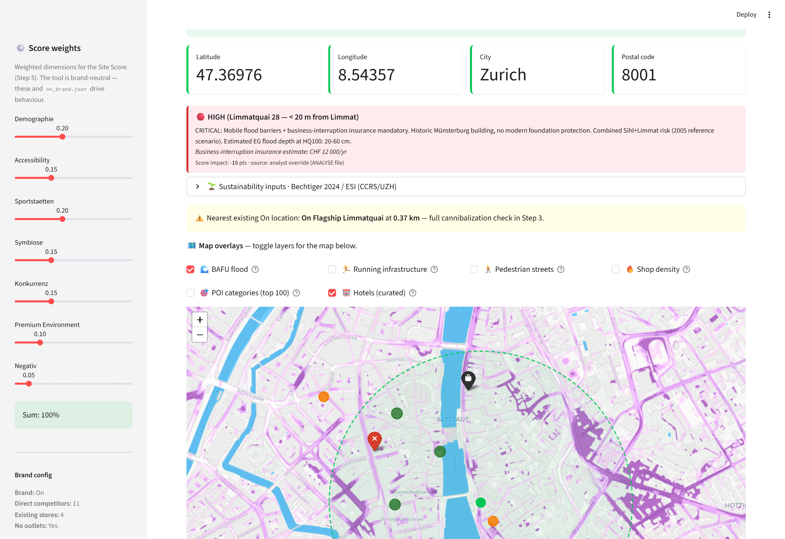
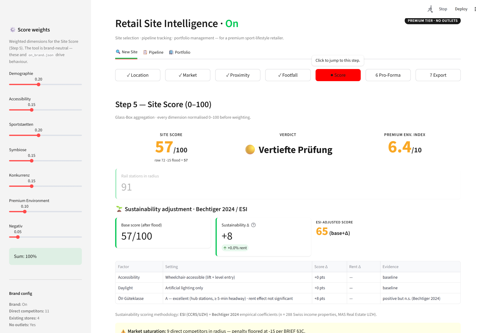
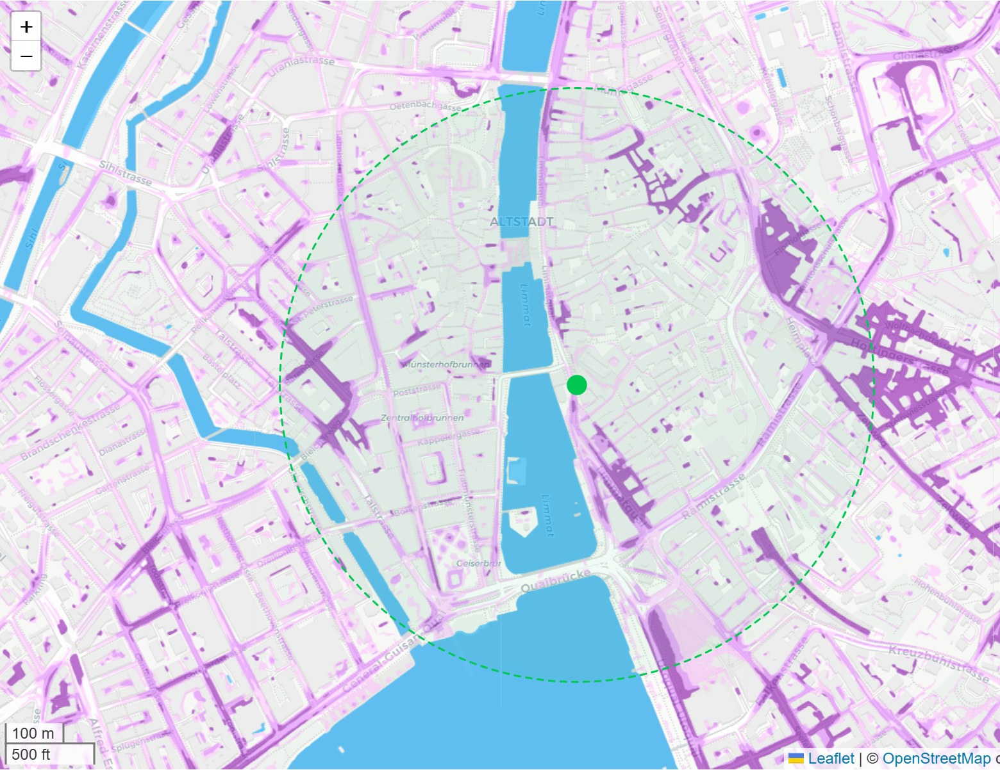
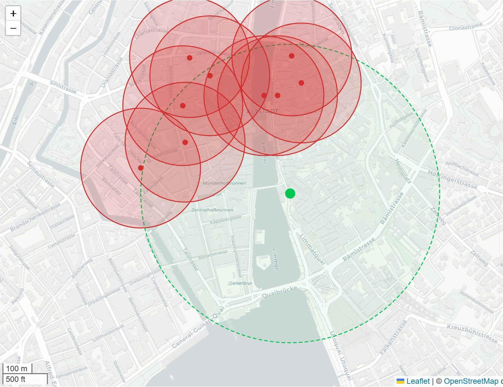
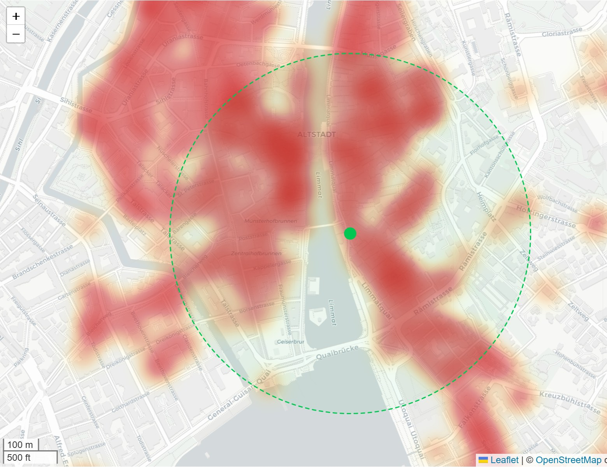

# Retail Site Intelligence

A locally-run Streamlit tool that walks a retail real-estate analyst through the
daily workflow of a premium sport-lifestyle brand — **site selection, financial
modelling, and portfolio management** — using only open data (OpenStreetMap, Swiss
BFS, BAFU, geo.admin.ch).

Scoped around **On** (the Swiss running/lifestyle brand) as a reference, but the
methodology generalises to any retailer by swapping one JSON config file.

> Reference products it emulates the *thinking* of: GrowthFactor, Placer.ai, SiteZeus.
> This is an open-source prototype, not an enterprise system.

---

## What it does

Three top-level tabs follow analyst **user stories**, not software features:

| Tab | Workflow |
|---|---|
| 🔍 **New Site** | 7-step funnel — Location → Market → Proximity → Footfall → Site Score → Pro-Forma → Export |
| 📋 **Pipeline** | Kanban board of in-flight sites *(scaffolded)* |
| 🏢 **Portfolio** | Lease calendar + alerts for active stores *(scaffolded)* |

### The New Site funnel

1. **Location** — geocode (Nominatim), Folium map, 10-min walking isochrone, automatic BAFU flood-risk check
2. **Market** — BFS demographics (population, Kaufkraft, age 18-45, growth), premium-environment signal (curated 5★/4★ hotels)
3. **Proximity intelligence** — one OSM query, brand-aware 12-step classification into sport / symbiose / premium / competitor / negative / partner, distance-weighted scoring, competitor-saturation logic, cluster detection
4. **Footfall** — amenity-richness Walk Score + transit accessibility
5. **Site Score** — Glass-Box 0-100 with per-dimension breakdown, Premium Environment Index, BAFU flood penalty, sustainability adjustment (Bechtiger 2024 / ESI)
6. **Leasehold Pro-Forma** — 5-yr DCF · NPV/IRR/payback · Bear/Base/Bull · live sensitivity sliders · retail KPIs (Occupancy Cost Ratio, Cash-on-Cash, Break-even sales)
7. **Export** — PDF Site Report · PDF Deal Memo · PowerPoint Product Overview

### Map layers (Proximity tab)

Every analytical layer is a toggleable overlay (all off by default):
🌊 BAFU flood · 🏃 running infrastructure · 🚶 pedestrian zones · 🔥 shop-density heatmap ·
🚆 transit stops · 🛍️ all shops · ⚠️ cannibalization circles · 🔵 classified POI markers ·
⚔️ competitor catchments · 🟢 walk-amenity density · 🏋️ sport density · 🏨 curated hotels.

---

## Screenshots

| Step 1 — Location + flood layer | Step 5 — Glass-Box Site Score |
|---|---|
|  |  |

| Flood-risk layer | Competitor catchments | Shop-density heatmap |
|---|---|---|
|  |  |  |

---

## Quick start

```bash
python -m venv .venv && source .venv/bin/activate      # Windows: .venv\Scripts\activate
pip install -r requirements.txt
cp .env.example .env                                    # set NOMINATIM_USER_AGENT
streamlit run app.py
```

Opens at <http://localhost:8501>. The first OSM query per location takes 5–30 s
(cached afterwards). Try the **walk-through presets** in the Step 1 dropdown.

**End-to-end smoke test:** `python smoke_test.py`
**Generate sample PDFs/PPT:** `python sample_run.py`

---

## Tech stack

`Streamlit` · `OSMnx` + `GeoPandas` + `Shapely` (geo) · `Folium` (maps) ·
`pandas` / `numpy-financial` (DCF) · `matplotlib` + `plotly` + `contextily` (charts/basemaps) ·
`ReportLab` (PDF) · `python-pptx` (slides) · `Playwright` (screenshot automation, dev only).

---

## Data sources & methodology

- **OpenStreetMap** via OSMnx — POIs, transit, pedestrian network, running infrastructure
- **BFS STATPOP 2024** — Swiss municipal demographics (24 ZH-relevant munis seeded)
- **BAFU** surface-runoff hazard — flood-risk WMS overlay + analyst overrides
- **ESI (CCRS/UZH)** + **Bechtiger 2024** (MAS Real Estate thesis, n=288 Swiss income
  properties) — sustainability scoring coefficients
- **Glass-Box principle** — every score dimension is normalised 0-100 *before* weighting
  and fully inspectable

Full methodology in **[`SCORING.md`](SCORING.md)**.

The tool is brand-neutral: `data/config/on_brand.json` drives all brand-specific logic
(competitors, adjacencies, premium tiers, existing stores, curated overrides). Swap it
to retarget any retailer.

---

## Project structure

```
app.py                  Streamlit entry · 3-tab nav
modules/                Tab views (site_analysis · pipeline · portfolio)
utils/                  geocoding · OSM classification · scoring · DCF · flood ·
                        sustainability · charts · PDF/PPT export
data/config/            on_brand.json (brand config) · score_weights.json
data/bfs/               seeded Swiss demographic CSV
tools/                  Playwright screenshot pipeline
docs/screenshots/       curated README visuals
```

---

## Disclaimer

Independent project. **Not affiliated with, endorsed by, or representing On AG.**
"On" is used solely as a reference brand to scope a realistic premium-retail
analysis. All competitor/hotel/store data is from public sources or
analyst-curated estimates, provided as-is. No warranty.

## License

[MIT](LICENSE) — code only. Third-party data retains its respective licenses
(OpenStreetMap © OpenStreetMap contributors, ODbL; Swiss federal data under
opendata.swiss terms).
